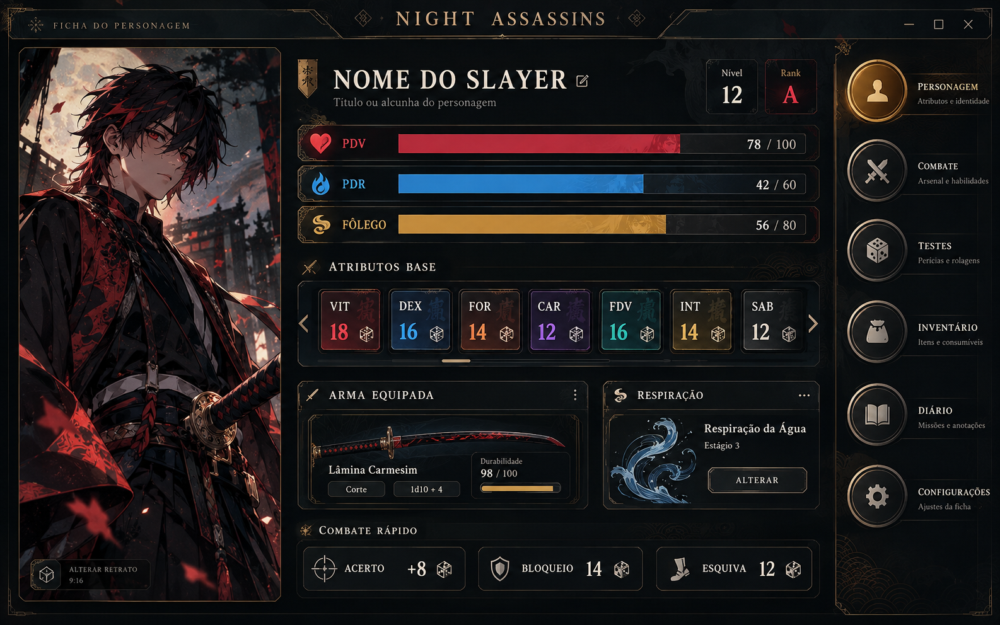
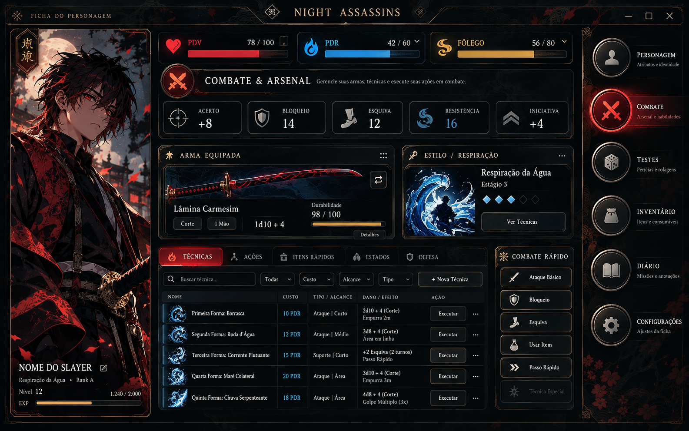
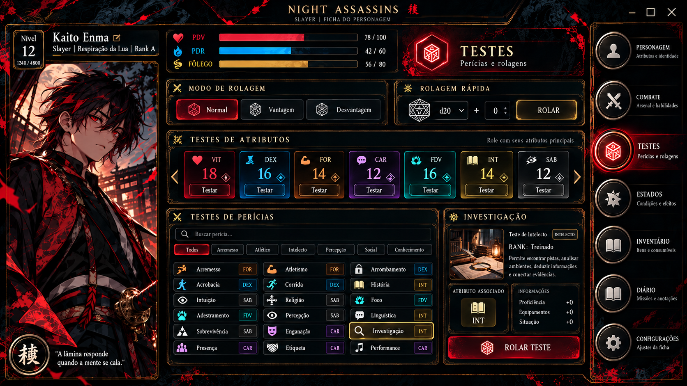
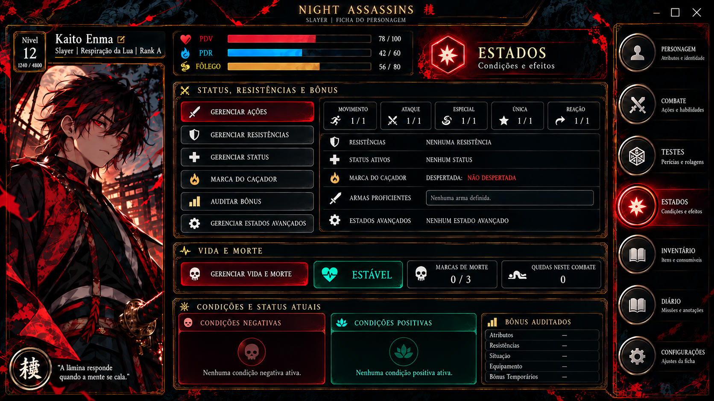
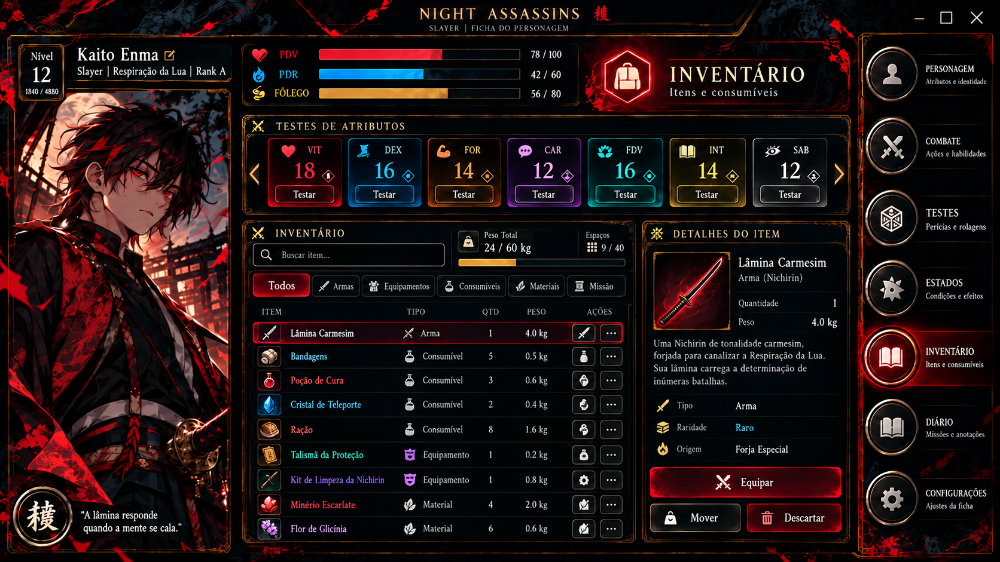
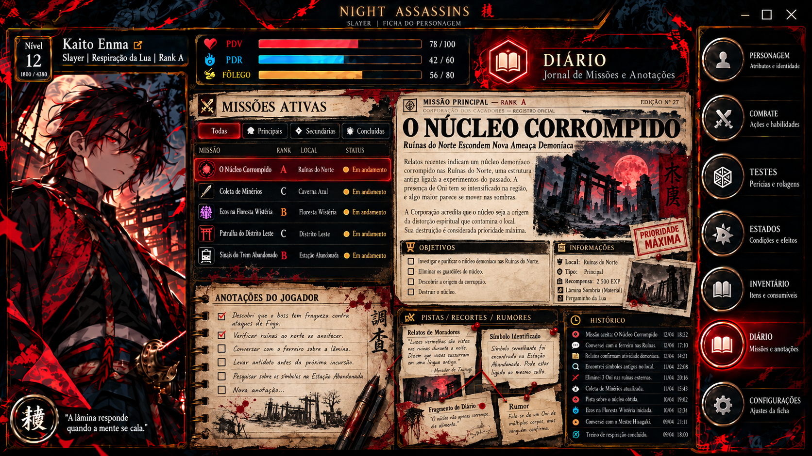
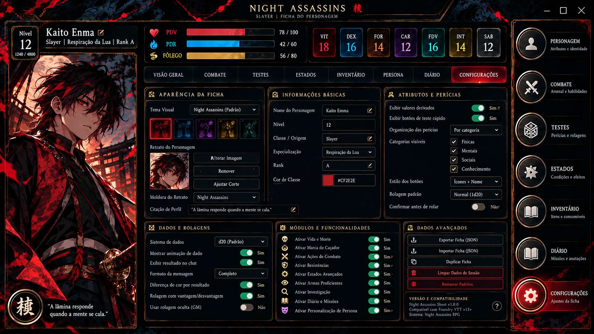

<div align="center">


# NIGHT ASSASSINS
### Sistema de RPG para Foundry VTT

**Caçadores • Onis • Respirações • Combate • Progressão**

[](https://foundryvtt.com/)
[](LICENSE)
[](https://github.com/SoftMissT/night-assassins-system)

[**RELEASES**](https://github.com/SoftMissT/night-assassins-system/releases)
|
[**REPORTAR ERRO**](https://github.com/SoftMissT/night-assassins-system/issues)
|
[**DOCUMENTAÇÃO**](plans/night-assassins-system-blueprint.md)
</div>

> [!WARNING]
> **Em desenvolvimento.** O suporte a Foundry
> v13.350–v14.999 é uma meta de compatibilidade,
> ainda não integralmente validada — a validação
> runtime no Foundry continua pendente.

---

## A ficha Slayer

Interface Dark Taishō MMORPG, com navegação
inspirada em Sword Art Online e identidade
visual de Night Assassins.



### Combate



### Testes e perícias



### Estados e resistências



### Inventário



### Diário de missões



### Configurações



> As imagens acima representam designs de
> referência. Nem todas as funções ilustradas
> estão implementadas na versão atual.

---

## Instalação

Quando a primeira versão estável for publicada:

1. Abra o Foundry VTT.
2. Selecione **Game Systems**.
3. Clique em **Install System**.
4. Cole a URL do manifesto abaixo.
5. Clique em **Install**.

URL do manifesto da release mais recente:

```text
https://github.com/SoftMissT/night-assassins-system/releases/latest/download/system.json
```

### Download direto

[**Última release estável**](https://github.com/SoftMissT/night-assassins-system/releases/latest)

[**Todas as versões e testes**](https://github.com/SoftMissT/night-assassins-system/releases)

---

## Estado do desenvolvimento

| Recurso | Estado |
|---|---|
| Ficha Slayer | Protótipo nativo |
| PDV, PDR e Fôlego | Implementação inicial |
| Testes e perícias | Em desenvolvimento |
| Combate | Pendente |
| Inventário completo | Pendente |
| Estados e resistências | Pendente |
| Diário interativo | Pendente |
| Fichas Oni e NPC | Pendente |
| Migração do CSB | Pendente |

## Desenvolvimento

```bash
npm test
```

O sistema está sendo reconstruído sem
dependência do Custom System Builder.

## Autoria

**SoftMissT**

[GitHub](https://github.com/SoftMissT)

Licença MIT. Consulte [LICENSE](LICENSE).
